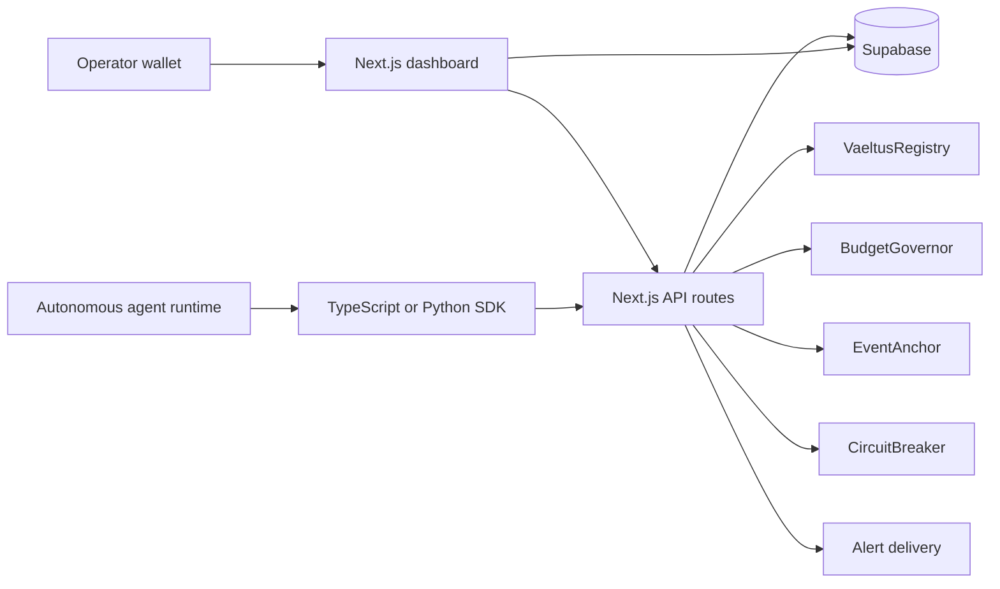
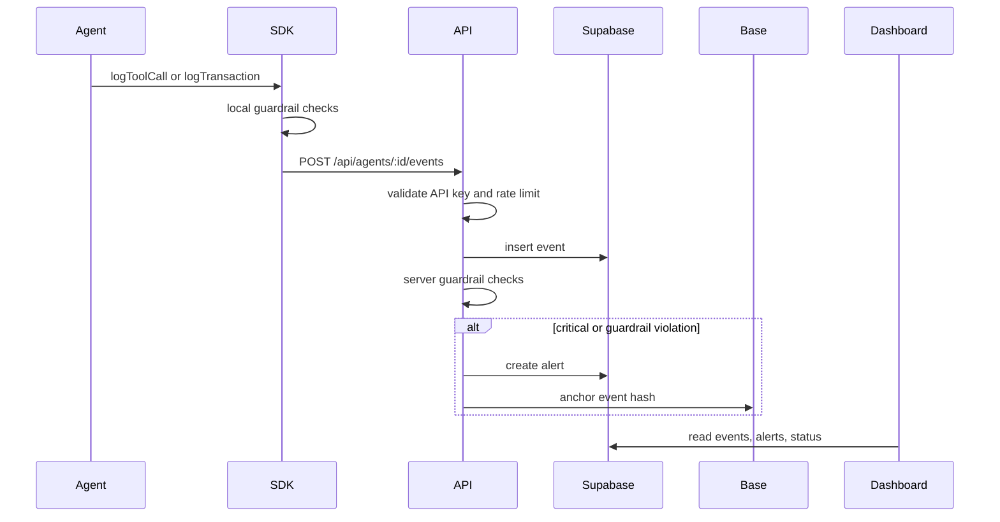

# Architecture

VAELTUS is organized as a monorepo with a web/API application, SDK packages,
smart contracts, database migrations, and an agent simulator.

## System Diagram

## Main Components

| Component | Path | Responsibility |
| --- | --- | --- |
| Web app | `apps/web` | Landing pages, dashboard pages, wallet auth UI, API routes, tests, and shared UI components. |
| Agent simulator | `apps/agent` | OpenRouter and Base Sepolia demo agent that registers, executes, reports, and respects guardrails. |
| TypeScript SDK | `packages/sdk` | Installable package for event logging, heartbeats, traces, retry behavior, and client-side guardrails. |
| Python SDK | `packages/python-sdk` | Python package with async event, heartbeat, trace, and guardrail helpers. |
| Contracts | `contracts` | Foundry project with registry, budget, event anchoring, and circuit breaker contracts. |
| Supabase | `supabase` | Migrations, RLS policies, rate limits, notification settings, and seed data. |

## Data Planes

VAELTUS has three practical data planes:

| Plane | What It Handles |
| --- | --- |
| Operator plane | Wallet sign-in, dashboard reads, guardrail updates, API key rotation, alert acknowledgement, and circuit breaker controls. |
| Agent plane | API-key authenticated events, heartbeats, transaction logs, reasoning traces, and local guardrail pre-checks. |
| Audit plane | Onchain registration, budget sync, critical event anchoring, circuit-break state, and operator audit logs. |

## Trust Boundaries

| Boundary | Enforcement |
| --- | --- |
| Browser to API | Wallet session cookie created from signed wallet challenge. |
| Agent to API | Bearer API key stored as a hash in Supabase. |
| API to Supabase | Server-side service role key. Browser clients should never receive this key. |
| API to contracts | Dedicated relayer or wallet transaction with scoped contract roles. |
| Contract state | AccessControl roles and owner checks in Solidity contracts. |

## Runtime Event Flow

## Onchain Sync Modes

By default, the API records offchain state and attempts onchain sync best-effort.
If `REQUIRE_ONCHAIN_SYNC=true`, routes that need onchain writes return an error
when the onchain transaction fails. Use that mode only when the deployment has
funded relayer keys, contract addresses, and roles configured.
